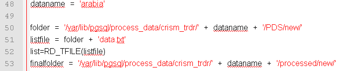
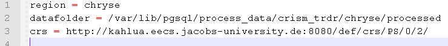

# CRISM data guide  

This page will explain the steps needed to download, CAT process and ingest CRISM TRDR data into rasdaman. The last 
section contains a method to batch process CRISM MRDR data. 

## Prerequisites
1. ESRI ArcGIS 10+ with Python (2.7 for 10.1+ onwards)
2. IDL/ENVI and CRISM Analysis Tools (CAT, http://geo.pds.nasa.gov/missions/mro/crism.htm). CAT version 7.2.1. was used.
3. Download the files from https://github.com/planetserver/crism_rasdaman_ingestion
4. Download the files from https://github.com/planetserver/autocat. This contains 'diff' files. You need the original IDL routines which are provided in the CRISM Analysis Tools (CAT) download.
5. Have the python library BeautifulSoup 3 installed. Version 3.2.1 was used. See http://www.crummy.com/software/BeautifulSoup/
6. The scripts can be run in Windows or Linux except when mentioned explicitly.
7. Handy Linux command lines:   
        ```
        How many IMG files have been downloaded:
        ls -1 *.img|wc -l
 
        How many GB of data are in the folder:
        du -ch
        ```     
        
## CRISM TRDR data selection and download
1. First check if there are PDS footprint updates       

        ```
        python pds_updates.py
        ```     

Not only CRISM will be downloaded, check https://github.com/planetserver/crism_rasdaman_ingestion/blob/master/pdsode_updates.csv                          
If there are updates the shapefiles will be downloaded in the /footprints folder.

2. For each CRISM ProductID extract the data size
        ```
        Needs BeautifulSoup python library
        python crism_pds_size.py
        ```
        The resulting CSV is saved in the /pdssizes folder
        
3. Create a /regions folder and add polygon shapefiles with single polygons which mark the extent of the various ROI. These shapefiles can be made using ArcGIS and need to have a Mars geographic CRS. To connect the CRISM with CTX it is advised to load the MRDR footprint (/footprints/mars_mro_crism_mrdr_c0a.shp) into ArcGIS and select the appropriate tiles, extract them to a new polygon shapefile and merge them using the Editor toolbar. Give the polygon shapefiles appropriate names as they will be used by the python scripts.

4. Per region determine the CRISM ProductIDs    
        ```
        needs ArcPy so needs to run in Windows
        python productids_per_region.py
        ```     
This python script will use (if present) inrasdaman.txt (made by ingestlist.py) together with the ROI polygon shapefiles in the regions folder. It will create a list of to be added CRISM data, per region, in the regions folder.

5. Create the URL download list of the CRISM PDS data of each region.   
        ```
        python crism_urllist.py
        ```     
        It uses the CSV in the pdssizes folder as input (made by crism_pds_size.py). It goes through the .TXT files in           the regions folder and creates download list files in the download folder.
6. The data can now be downloaded using:
        ```
        wget -c -i <region_name>_urllist.txt
        ```     

## CRISM data processing

1. In the download folder create a list file with all the to be processed data:
        ```
        ls *trr3.img>data.txt
        ```
2. Open run_trdr.pro and make sure the input and output folders are set correctly.
        ```
        
        ```
3. Start ENVI classic in Linux
        ```
        envi -classic
        ......
        ENVI> cd,'/path/to/autocat/'
        ENVI> run_trdr
        ```
4. The processing will run automatically. This can take a couple of hours depending on the amount of data.

## CRISM data ingestion
1. Make the CRISM data definitions for rasdaman community or for rasdaman enterprise with null value support:   
        
        ```
        Works only on Linux
        python rasset.py -make crismfile.img setname
         
        OR
         
        python rasset.py -make crismfile.img setname 1
        ```     
2. Add the definition to rasdaman:      
        ```
        Works only on Linux
        python rasset.py -add setname.def
        ```     
3. Do the above for all types of CRISM (TRDR IR, TRDR VNIR, MRDR, etcetera)!!!
4. Update or create crismingest.ini which contains the following three lines:   
        ```
        
        ```     
        
   The region variable is added to the JSON file for each CRISM. This is needed by the classic client.

5. Create a list file in the 'datafolder' with all the processed CRISM filenames        
        ```
        Works only on Linux
        python crismingest.py -c
        ```     
6. Ingest the processed CRISM data (can take a while!). After the ingestion a check is done if all the data have successfully been added. Further ingest or re-ingest if necessary.      
        ```
        Works only on Linux
        python crismingest.py -i
        ```     
7. Finalize. The JSON files in the /metadata/ folder and an updated rasdaman.js will be made. Both need to be added to /var/www/html/classic/. A link to the PDS ODE REST service XML is added to WCS DescribeCoverage of each CRISM in rasdaman.       
        ```
        Works only on Linux
        python crismingest.py -f
        ```     
        
## Finalize
1. Copy inrasdaman.js and the updated /metadata/ folder to /var/www/html/classic/
2. Create a new polygon shapefile with all the CRISM in PlanetServer:   
        ```
        python ingested_footprints_sf.py 
        ```     
The shapefile is saved in the footprints folder and needs to be made into a zipfile (mars_mro_crism_trdr_frthrlhrs07_c0a_planetserver.zip) and copied to /var/www/html/data/

## EXTRA: CRISM MRDR data processing
1. As with the TRDR data, first check if there are PDS footprint updates        
        ```
        python pds_updates.py
        ```     
Not only CRISM will be downloaded, check https://github.com/planetserver/crism_rasdaman_ingestion/blob/master/pdsode_updates.csv
If there are updates the shapefiles will be downloaded in the /footprints folder.

2. Open /footprints/mars_mro_crism_mrdr_c0a.shp in ArcGIS and go to Layer Properties > Definition Query and fill in:    
        ```
        "ProductId" LIKE 'T%IF%3'
        ```     
3. Select the tiles you would like to process, go to the Attribute Table and export as DBF. Open the DBF and copy all the LabelURL fields in a text editor. Open another text editor window and copy the fields again, but do a replace all from .lbl to .img. Combine this .img download list and the .lbl download list and use wget -c -i <listfile> to download all the necessary data.


