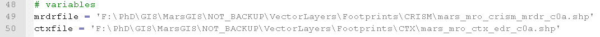
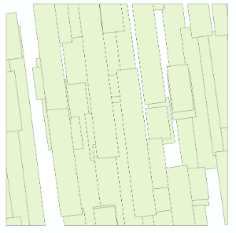
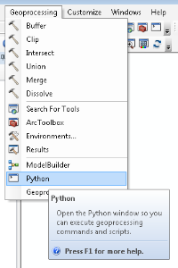
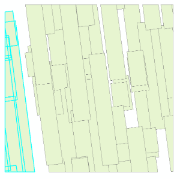

# CTX data guide
## Set up the working folder
1. Save ctx_mosaic_inside_extent.py, badctxproductid.txt, bottomctxproductid.txt to a working folder.    

2. You need to get the CRISM MRDR and CTX footprint shapefiles. Use the pds_updates.py script explained in CRISM data guide 
or download the shapefiles manually from the PDS ODE: http://ode.rsl.wustl.edu/mars/coverage/ODE_Mars_shapefile.html  

3. Open ctx_mosaic_inside_extent.py in a text editor and change the paths to the CRISM MRDR and CTX footprint shapefiles:
4. Also change in ctx_mosaic_inside_extent.py the .SH template for blackpearl to reflect your own account. 
The following screenshot shows the line numbers of the template in the python script.
  ```
  
  ```
IMPORTANT:
Make sure you set the correct email address!
Please do not remove any %s.

## Check CTX browse imagery

1. Run ctx_mosaic_inside_extent.py
     ```
      Uses ArcPy so needs Windows
      python ctx_mosaic_inside_extent.py mrdr <ProductId> 1
       
      OR
       
      python ctx_mosaic_inside_extent.py sf <shapefile location> 1
    ```
    Either refer to a CRISM MRDR ProductId (e.g. T0447_MRRIF_35S023_0256_3) or refer to a polygon shapefile with one polygon feature defining the extent of the mosaic.
    Please don't forget to use 1 to download browse images from the JMars server.
2. In the working folder a new folder has been created with the name of the shapefile or the MRDR ProductId. Within this folder a browse folder has been created. Go through the JMars browse imagery. If you see a bad CTX add the ProductId (the browse image file name) to badctxproductid.txt. If you notice a CTX which is still OK to use but you would like it to be on the bottom of the mosaic add the ProductId to bottomctxproductid.txt
3. You can now delete the browse folder.
4. If you needed to add files to the bad and/or bottom .txt files please rerun ctx_mosaic_inside_extent.py now using 0 instead of 1.

## Make 'islands' using ArcGIS

1. Open ArcGIS and add the shapefile which was created in the new folder
  ```
    
  ```

2. Use the Editor to remove those features which have too small area's (that's a bit of trial and error but just be 
aware that too small slivers will result in an error during mosaicking). 
You can use http://www.jennessent.com/arcgis/shapes_graphics.htm to derive area's of polygons and then sort them from 
small to large in the Attribute Table.

3. Open the Python window
  ```
  
  ```
4. Select those features belonging to one 'ISLAND':
  ```
  
  ```
  
  You can use the Lasso tool:
  ```
  
  ```
  
5. Open the Attribute Table and check in the ISLAND field that all selected rows are empty. If one or more contain 
BOTTOM unselect them. Please check if the ISLAND is still one single ISLAND once you unselect the BOTTOM rows! 
You can also give all the BOTTOM ones a distinct color using Symbology.

6. Copy/paste the following python code into the Python window:
  ```
  import os 
  import arcpy  
  import pythonaddins 
     
  folder = "C:/path/" 
  island = "ISLAND1"  
    
  f = open(os.path.join(folder, island.lower() + '.lst'), 'w')  
  SelectedLayer = pythonaddins.GetSelectedTOCLayerOrDataFrame() 
  rows = arcpy.UpdateCursor(SelectedLayer)  
  for row in rows:  
      f.write(row.ProductId + '.lev2.cub\n')  
      row.setValue("ISLAND", island)  
      rows.updateRow(row) 
  f.close() 
  ``` 
    
 Before running set the folder variable to the new folder path. And set the island variable to a distinct name.
7. Repeat 4,5 and 6 for the other islands. With respect to 6 set the island variable to a distinct name.
8. Make sure to clear selected features
  ```
  
  ```
9. Make sure to select the shapefile in the Table of Contents (warning)

10. Copy/paste the following python code into the Python window
    ```
    import arcpy  
    import os 
    import pythonaddins 
    import random 
    import string 
    arcpy.overwriteOutput = True  
      
    def id_generator(size=6, chars=string.ascii_lowercase + string.digits): 
        return ''.join(random.choice(chars) for x in range(size)) 
      
    folder = "C:/path/" 
    filename = "mosaic.lst" 
          
    f = open(os.path.join(folder, filename), 'w') 
    SelectedLayer = pythonaddins.GetSelectedTOCLayerOrDataFrame() 
    outDataset = os.path.join(arcpy.env.scratchFolder, id_generator() + '.shp') 
    arcpy.Sort_management(SelectedLayer, outDataset, [['ISLAND', 'ASCENDING']]) 
    rows = arcpy.SearchCursor(outDataset) 
    bottom = [] 
    for row in rows:  
        island = row.ISLAND 
        if island == "BOTTOM":  
            bottom.append(row.ProductId)  
        else: 
            f.write(row.ProductId + '.lev2.equ.cub\n')  
    for ctx in bottom:  
        f.write(ctx + '.lev2.cub\n')  
    f.close() 
    ```
Before running set the folder variable to the new folder path. A mosaic.lst file will be created.

## Getting ready for blackpearl
1. Open the .SH file created in the new folder. Add the equalizer lines for each ISLAND.
2. You can now start adding files to blackpearl. On blackpearl go to your working folder and make a folder with the same name as the new folder (the name of the shapefile or the MRDR ProductId).
3. Add the .map, .sh, the islands lists and mosaic.lst to the folder on blackpearl. Also add CTX_parallel_pds2lev2.py.

4. On blackpearl/MAMOC define a specific .IMG download folder and go there using shell. Use VI or another editor to create tbcopied.txt (or another name). Copy/paste the content of <new folder>_img_files.txt from the new folder into tbcopied.txt using VI. You cannot simply copy <new folder>_img_files.txt because it has been created in Windows.

5. Add the <new folder>_download.txt to the .IMG download folder and use: 
  ```
  wget -c -i <new folder>_download.txt  
  ``` 
6. After the download you can now use the following line to copy only the .IMG files listed in tbcopied.txt to the mosaic folder:  
  ```
  xargs -a tbcopied.txt cp -t /path/to/dest/
  ``` 
7. Now you should have a .SH, .MAP, various .LST, many .IMG and a .PY in the folder where the processing will take place.
8. You can now do qsub <new folder>.sh
9. Use qstat -u username to check for the content

## GDAL and MapServer

1. Download the 8bit.cub to a Windows computer with GDAL and use: 
  ```
  gdal_translate <name>_8bit.cub <name>.tif
  gdal_translate -of JP2OpenJPEG <name>_8bit.cub <name>.jp2
  ``` 
The .JP2 can now be shared for offline ArcGIS use. The .TIFF can now be added to PlanetServer

2. OPTIONAL: IF YOU DON'T HAVE BIGTIFF SUPPORT IN GDAL:
Break up the TIFF file into smaller parts using gdal_splitraster.py:
python gdal_splitraster.tif <name>.tif <nr>

This is a bit of trial and error. If you choose nr=2 then you will get a split of 2x2=4 different TIFF files. For each you have to run the following script:

3. Make a TILED version of the TIFF using 2tiledtiff.py:  
  ```
  python 2tiledtiff.py <name>.tif
  ``` 
4. Make a tile index shapefile, or add to tile index shapefile: 
  ```
  gdaltindex -write_absolute_path <name>.shp *tiled.tif
  ``` 
5. Make a .map file for MapServer. Here is an example:    
      ```
      #
      # Start of map file
      #
      MAP
      
        NAME "noachis"    
        STATUS ON   
        SIZE 500 500    
        # EXTENT # commented out, as it will be calculated on-the-fly   
        UNITS METERS # Use UNITS DD if the PROJECTION is a geographic CRS   
        SHAPEPATH "data"    
        #CONFIG "MS_ERRORFILE" "/home/earthserver/ms_temp/ms_error.txt"   
        IMAGETYPE PNG      
        #   
        PROJECTION
        
          "+proj=eqc"   
          "+lat_ts=0"   
          "+lat_0=0"    
          "+lon_0=0"    
          "+x_0=0"    
          "+y_0=0"    
          "+a=3396190"    
          "+b=3396190"    
          "+units=m"    
          "+no_defs"    
        END   
  
  #   
  # Start of web interface definition (including WMS enabling metadata)   
  #   
  WEB   
  
    # change the next two lines to match your setup   
    IMAGEPATH "/home/piero/Downloads/ms4w/tmp/ms_tmp/"    
    IMAGEURL "/ms_tmp/"   
    METADATA
    
      "wms_title"           "PlanetServer WMS"    
      "wms_onlineresource"  "http://planetserver.jacobs-university.de/cgi-bin/mapserv?map=noachis.map&"   
      "wms_srs"             "EPSG:4269 EPSG:4326"   
      "wms_enable_request" "*"    
    END   
  END      
  #   
  # Start of layer definitions    
  #   
  LAYER   
  
    NAME "noachis"    
    TYPE RASTER   
    STATUS ON   
    TILEINDEX "/var/lib/pgsql/process_data/wms/noachis/noachis.shp"   
    TILEITEM "location"   
    # Color mapping   
    PROCESSING "SCALE=0,255"    
    PROCESSING "SCALE_BUCKETS=256"    
  END #layer    
  OUTPUTFORMAT    
  NAME "png"    
  DRIVER AGG/PNG        
  MIMETYPE "image/png"    
  IMAGEMODE RGB   
  EXTENSION "png"   
  FORMATOPTION "GAMMA=0.75"   
  TRANSPARENT ON    
  END   
  END #map    
      ```
